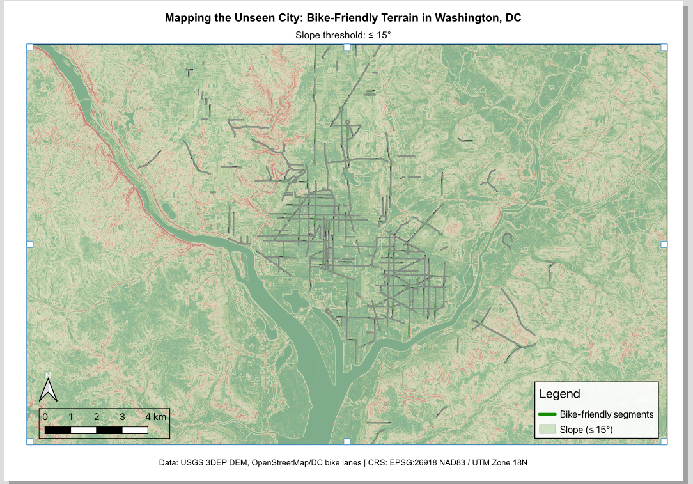
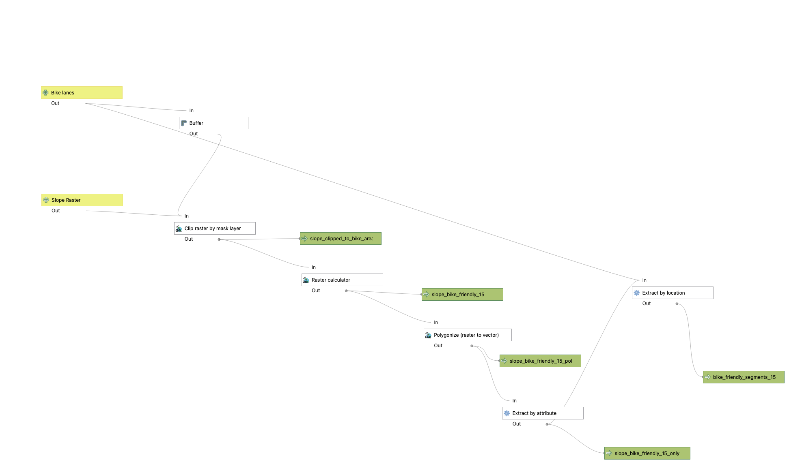

# Mapping the Unseen City  
## LiDAR-Driven Bike-Friendly Terrain Analysis in Washington, DC

---

## Project Overview

Urban mobility is not only about where roads and bike lanes exist. Terrain plays a critical role in how usable and comfortable these routes are. A bike lane may technically exist on a map, but steep slopes can make it difficult or impractical for many users.

In this project, I used LiDAR-derived elevation data, slope analysis, QGIS Model Builder, and Python automation to identify **existing bike lane segments located on bike-friendly terrain (≤ 15° slope)** in Washington, DC.

The workflow transforms raw elevation data into a clear, decision-ready GIS output by combining:

- Automated spatial analysis (Part A)
- Automated map production (Part B)

---

## Tools and Technologies

- QGIS 3.44 (Solothurn)
- QGIS Graphical Modeler
- PyQGIS (Python Console)
- GDAL
- GeoPackage
- USGS 3DEP DEM
- OpenStreetMap / DC Bike Data
- CRS: EPSG:26918 (NAD83 / UTM Zone 18N)

---

## Data Sources

| Dataset | Source | Purpose |
|--------|--------|--------|
| DEM | USGS 3DEP | Elevation surface |
| Slope | Derived from DEM | Terrain steepness |
| Bike Lanes | OSM / DC Data | Transportation layer |
| Output | Model result | Bike-friendly segments |

---

## Coordinate System

All layers were aligned to:

EPSG:26918 — NAD83 / UTM Zone 18N

This ensures:
- Units in meters  
- Accurate slope and distance calculations  

---

# Part A — QGIS Model Builder Automation

## Goal

Automatically identify **bike lane segments located on terrain with slope ≤ 15°** using a repeatable workflow.

---

## Workflow Overview

This model converts terrain data into a transportation insight through a series of spatial operations.

---

### Step 1 — Slope Raster Input

**What happens:**  
Load the slope raster derived from DEM.

**Why it matters:**  
Each pixel represents terrain steepness, which is the foundation for defining bike-friendly areas.

---

### Step 2 — Bike Lane Input

**What happens:**  
Load bike lane vector data.

**Why it matters:**  
This is the network we evaluate against terrain conditions.

---

### Step 3 — Buffer Bike Lanes

**Settings:**
- Distance: 50 meters  
- Dissolve: Yes  

**Why it matters:**  
Instead of analyzing the entire city, we limit the analysis to areas near bike lanes.  
This significantly improves performance.

---

### Step 4 — Clip Slope Raster

**Output:**

slope_clipped_to_bike_area

**Why it matters:**  
Reduces data size and speeds up all downstream operations.

---

### Step 5 — Raster Calculator

**Expression:**

A <= 15

**Output:**

slope_bike_friendly_15

**Why it matters:**  
Transforms continuous slope values into a binary classification:
- 1 = bike-friendly  
- 0 = not bike-friendly  

---

### Step 6 — Polygonize Raster

**Output:**

slope_bike_friendly_15_polygon

**Why it matters:**  
Converts raster into vector polygons so spatial overlay becomes possible.

---

### Step 7 — Extract Suitable Terrain

**Condition:**

DN = 1

**Output:**

slope_bike_friendly_15_only

**Why it matters:**  
Filters out only the terrain that meets the bike-friendly criteria.

---

### Step 8 — Extract Bike-Friendly Segments

**Output:**

bike_friendly_segments_15

**Why it matters:**  
Identifies bike lane segments that intersect suitable terrain.  
This is the final analytical result.

---

# Part B — Python Print Layout Automation

## Goal

Automatically generate a **clean, professional, print-ready map layout** using PyQGIS.

---

## Layout Design

The layout was designed to be simple, readable, and portfolio-ready.

### Map Position

X: 15 mm
Y: 30 mm
Width: 265 mm
Height: 190 mm

This ensures the map covers ~98% of the page.

---

## Layout Elements

The automated layout includes:

- Title and subtitle
- Large map frame
- Legend (bottom-right inside map)
- Scale bar (bottom-left inside map)
- North arrow (above scale bar)
- Data attribution

---

## Visual Design Choices

### Slope Background
Used as a contextual terrain layer with reduced opacity to avoid overpowering the map.

### Bike-Friendly Segments
Highlighted as the main layer using a darker green color to ensure visibility.

### Legend
Simplified to only include:

Bike-friendly segments
Slope (≤ 15°)

This keeps the map focused and easy to interpret.

---

## Python Workflow Summary

The script performs the following:

1. Loads required layers:
   - slope  
   - dem_merged  
   - bike_friendly_segments_15  

2. Creates layout:

Mapping_the_Unseen_City_Print_Layout

3. Sets page to landscape format

4. Adds and positions map

5. Applies styling:
   - Bike lines → dark green  
   - Slope → semi-transparent  

6. Adds layout elements:
   - Title  
   - Legend  
   - Scale bar  
   - North arrow  

7. Generates a print-ready layout

---

## Repository Structure

mapping-the-unseen-city-dc/

README.md

qgis/
Bike_Friendly_Terrain_Analysis_Clean.model3
Mapping_the_Unseen_City_DC.qgz

scripts/
Mapping_the_Unseen_City_Print_Layout.py

outputs/
model_screenshot.png
final_print_layout.png
final_map_export.png
final_map_export.pdf

---

## Summary

This project demonstrates a complete GIS workflow:

- Terrain analysis using LiDAR-derived DEM  
- Spatial filtering using slope threshold  
- Automation using QGIS Model Builder  
- Map production using Python  

The result is a reproducible pipeline that transforms raw elevation data into a practical, transportation-focused insight.
